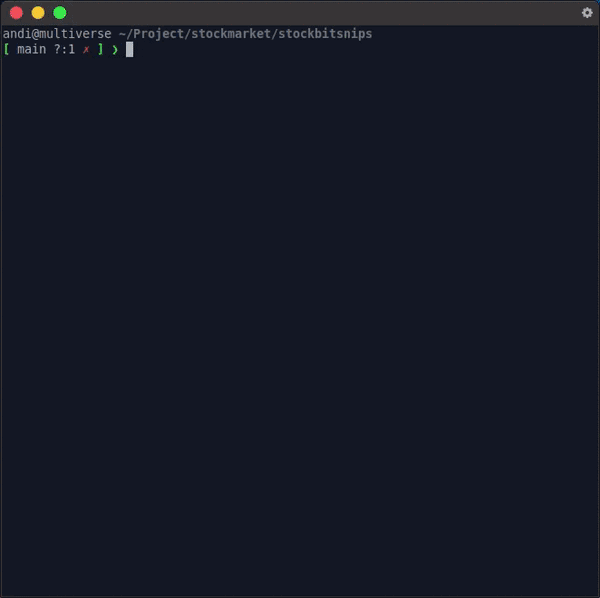

# Stockbit Newsletter

Fetches the latest newsletter URLs from [Snips](https://snips.stockbit.com/) by Stockbit. Also, looks for articles related to some topics using a tag.



### Requirements

- Python 3
- Requests
- Beautiful Soup 4

### Usage

You can use a ticker or a keyword for tag and keep category as default (recent news).

**Tag usage**

- ticker: `ANTM` or `TLKM` in uppercase
- single word: `inflasi`, `kredit`, `konstruksi`
- multiple word: `batu bara`, `mobil listrik`, `rights issue`

Example:

Return recently published Snips' articles:

```
python3 snips.py
```

Save currently available newsletter with tag `konstruksi`

```
python3 snips.py -t konstruksi -s
```

Save currently available newsletter with tag `mobil listrik`

```
python3 snips.py -t 'mobil listrik' -s
```

For more details:

```
python3 snips.py -h
```

